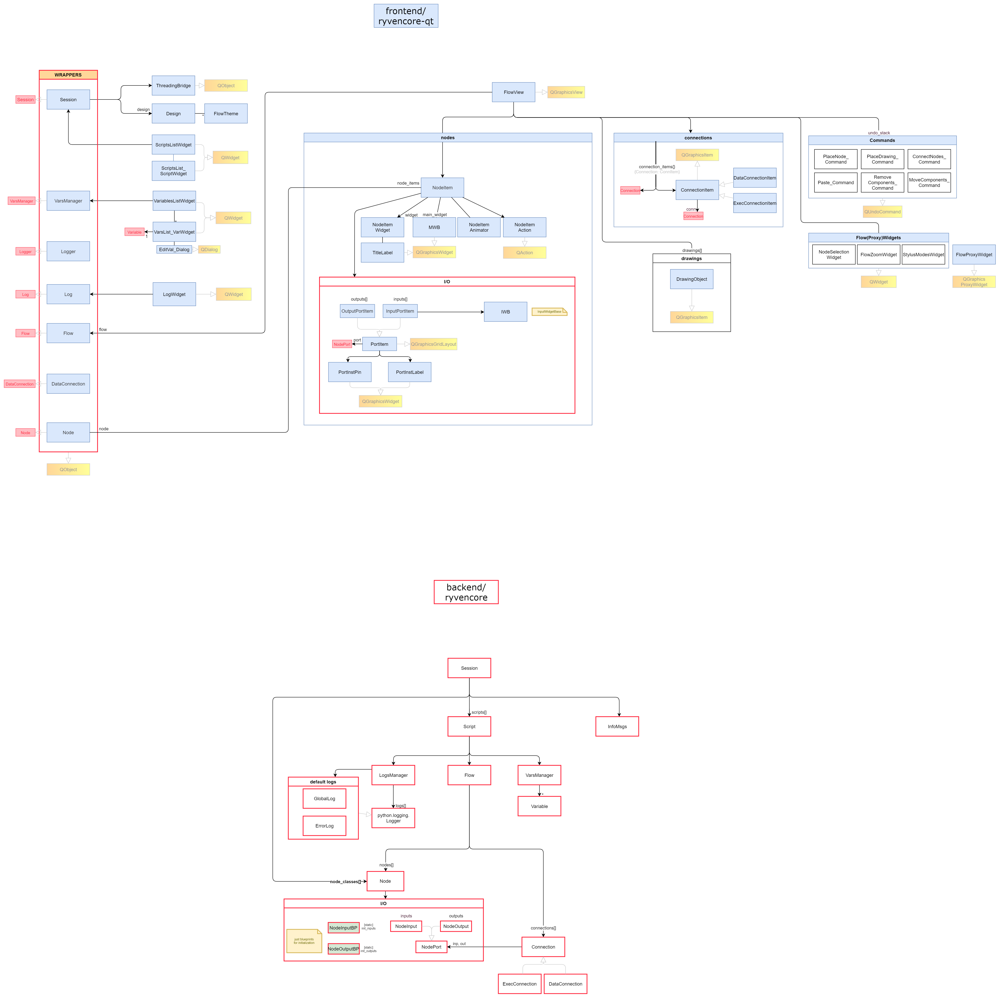

<p align="center">
  
</p>

`rvencore-qt` is a **Python library for building visual node editors**. It comes from the [Ryven](https://github.com/leon-thomm/Ryven) project and will be the foundation for future Ryven versions. Technically, `ryvencore-qt` provides a Qt-based frontend for what is now referred to as `ryvencore`. However, `ryvencore` itself is currently still included in this repository. `ryvencore` implements all the abstract functionality and can be used to easily deploy flows directly on the backend.

# Details

**Installation**

```
pip install ryvencore-qt
```

or from sources
```
git clone https://github.com/leon-thomm/ryvencore-qt
cd ryvencore-qt
python setup.py install
```

**Dependencies**

`ryvencore-qt` runs on PySide2 (bindings for Qt) using [QtPy](https://github.com/spyder-ide/qtpy) as a wrapper to eventually enable seamless switching between PySide2 and PySide6. Notice that `ryvencore-qt` does not work with PyQt, due to crucial inheritance restrictions in PyQt.

Saved projects can be deployed directly on the backend (`ryvencore`) which does not have a single dependency so far.

# quick start

The below code demonstrates how to set up an editor with custom defined nodes. You can also find the code in the *examples* folder.

`main.py`
``` python
# Qt
import sys
import os
os.environ['QT_API'] = 'pyside2'  # tells QtPy to use PySide2
from qtpy.QtWidgets import QMainWindow, QApplication

# ryvencore-qt
import ryvencore_qt as rc
from nodes import export_nodes


if __name__ == "__main__":

    # first, we create the Qt application and a window
    app = QApplication()
    mw = QMainWindow()

    # now we initialize a new ryvencore-qt session
    session = rc.Session()
    session.design.set_flow_theme(name='pure light')  # setting the design theme

    # and register our nodes
    session.register_nodes(export_nodes)

    # to get a flow where we can place nodes, we need to crate a new script
    script = session.create_script('hello world', flow_view_size=[800, 500])

    # getting the flow widget of the newly created script
    flow_view = session.flow_views[script]
    mw.setCentralWidget(flow_view)  # and show it in the main window

    # finally, show the window and run the application
    mw.show()
    sys.exit(app.exec_())
```

`nodes.py`
```python
import ryvencore_qt as rc
from random import random


# let's define some nodes
# to easily see something in action, we create one node generating random numbers, and one that prints them

class PrintNode(rc.Node):
    """Prints your data"""

    title = 'Print'
    init_inputs = [
        rc.NodeInputBP(),
    ]
    init_outputs = []
    color = '#A9D5EF'

    # we could also skip the constructor here
    def __init__(self, params):
        super().__init__(params)

    def update_event(self, inp=-1):
        print(
            self.input(0)  # get data from the first input
        )


class RandNode(rc.Node):
    """Generates scaled random float values"""

    title = 'Rand'
    init_inputs = [
        rc.NodeInputBP(dtype=rc.dtypes.Data(default=1)),
    ]
    init_outputs = [
        rc.NodeOutputBP(),
    ]
    color = '#fcba03'

    def update_event(self, inp=-1):
        # random float between 0 and value at input
        val = random() * self.input(0)

        # setting the value of the first output
        self.set_output_val(0, val)


export_nodes = [
    PrintNode,
    RandNode,
]
```

For a more detailed overview, including a precise definition of flows, see [Features Page](https://leon-thomm.github.io/ryvencore-qt/features/) and .

***

<!--
#### threading compatibility  
All communication between frontend (`ryvencore-qt`) and backend (`ryvencore`) is based on Qt signals. Therefore, there exists rudimentary threading compatibility, i.e. you can keep your session object in a separate thread to improve concurrency and prevent the backend from being slown down signicantly by the frontend, and all changes you perform directly on the backend are automatically noticed by the frontend. While this is currently extremely experimental and far from production ready, it opens the door to the world of realtime data processing and first successful tests have been made.
-->


### Contributions and Development

This project will eventually need a community in order to survive. Particularly effective ways to contribute outside of direct development of the software are creating

- tutorials
- nodes
- small editors
- documentation
- tests
- etc

If you have any questions, suggestions, or want to show something you've built with this project notice the *discussions* area which is the perfect place for that.

To give a quick overview over the most important class relations, see the below class diagram. The DrawIO diagram file is in the repository.


